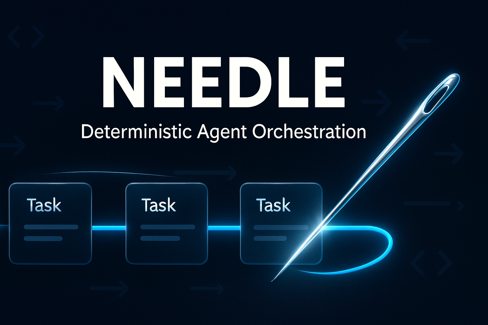

# 🧵 NEEDLE

[](https://github.com/jedarden/NEEDLE/actions/workflows/ci.yml)
[](LICENSE)
[](rust-toolchain.toml)
[](Cargo.toml)

**N**avigates **E**very **E**nqueued **D**eliverable, **L**ogs **E**ffort

> Deterministic bead processing with explicit outcome paths.

NEEDLE is a universal wrapper for headless coding CLI agents. It processes a shared bead queue in deterministic order, dispatching work to any headless CLI (Claude Code, OpenCode, Codex, Aider) and handling every outcome through an explicit, predefined path.

---

## 🚀 Quickstart

```bash
# Install the latest release
curl -fsSL https://github.com/jedarden/NEEDLE/releases/latest/download/install.sh | bash

# Or build from source
cargo install --git https://github.com/jedarden/NEEDLE

# Run a worker against a bead-tracked workspace
cd /path/to/your/workspace
needle run --agent claude --identity alpha
```

A worker starts, claims the next bead, dispatches to your chosen agent CLI, and loops. Multiple workers can run in parallel against the same workspace — coordination is handled by the shared bead queue (no central orchestrator).

See [`docs/examples/`](docs/examples/) for end-to-end configurations.

---

## 🤔 Why NEEDLE

Existing agent orchestration tools are built for one of two shapes:

- **Conversational frameworks** (LangGraph, AutoGen, CrewAI) assume a chat loop with a human-in-the-loop or another LLM. They are bad at headless, long-running, cost-bounded work.
- **Workflow engines** (Temporal, Argo Workflows, Inngest) assume each step is deterministic code. They are bad at non-deterministic agent steps whose outcomes have to be classified and routed.

NEEDLE is the missing middle: a **deterministic state machine that drives non-deterministic agents.** Every outcome an agent can produce has an explicit handler. The agent's work is fuzzy; the orchestration around it is not.

---

## 🧠 Core Principle

NEEDLE is a **state machine**, not a script. Every bead transitions through a finite set of states, and every transition has a defined handler. There are no implicit fallbacks, no swallowed errors, no undefined paths.

```
If an outcome can happen, it has a handler.
If it doesn't have a handler, it cannot happen.
```

---

## 🔄 The NEEDLE Algorithm

A single worker executes this loop indefinitely:

```
┌─────────────────────────────────────────────────────┐
│                                                     │
│   ┌───────────┐                                     │
│   │  🔍 SELECT │◄────────────────────────────────┐  │
│   └─────┬─────┘                                  │  │
│         │                                        │  │
│         ▼                                        │  │
│   ┌───────────┐   race lost    ┌──────────┐     │  │
│   │  🔒 CLAIM  │──────────────►│ 🔁 RETRY  │─────┘  │
│   └─────┬─────┘               └──────────┘        │
│         │ claimed                                   │
│         ▼                                           │
│   ┌───────────┐                                     │
│   │ 📋 BUILD   │                                     │
│   └─────┬─────┘                                     │
│         │                                           │
│         ▼                                           │
│   ┌───────────┐                                     │
│   │ 🚀 DISPATCH│                                     │
│   └─────┬─────┘                                     │
│         │                                           │
│         ▼                                           │
│   ┌───────────┐                                     │
│   │ ⏳ EXECUTE │                                     │
│   └─────┬─────┘                                     │
│         │                                           │
│         ▼                                           │
│   ┌───────────┐                                     │
│   │ 📊 OUTCOME │                                     │
│   └─────┬─────┘                                     │
│         │                                           │
│         ├── ✅ success ──► close bead ──────────────┘
│         ├── ❌ failure ──► log + release ────────────┘
│         ├── ⏰ timeout ──► release + defer ──────────┘
│         └── 💀 crash ────► release + alert ──────────┘
│                                                     │
└─────────────────────────────────────────────────────┘
```

---

## 📐 Algorithm Steps

### 🔍 Step 1: Select

Query the bead queue for the next claimable bead in **deterministic priority order**. Selection is not random — given the same queue state, every worker computes the same ordering. Ties are broken by creation time (oldest first).

### 🔒 Step 2: Claim

Attempt an **atomic claim** via `br update --claim`. SQLite transaction isolation guarantees exactly one worker succeeds. If the claim fails (race lost), return to Step 1 with the losing candidate excluded.

### 📋 Step 3: Build

Construct the prompt from the bead's context: title, body, workspace path, relevant files, and any dependency context. The prompt is a deterministic function of the bead state — same bead, same prompt.

### 🚀 Step 4: Dispatch

Load the agent adapter configuration (YAML), render the invoke template with the built prompt, and execute via `bash -c`. The agent runs headless — it receives a prompt, does work, and exits.

### ⏳ Step 5: Execute

The agent runs. NEEDLE waits. The only inputs are the exit code and stdout/stderr. There is no interactive communication during execution.

### 📊 Step 6: Outcome

Evaluate the result and follow the **explicit path** for the observed outcome:

| Outcome | Exit Code | Handler |
|---------|-----------|---------|
| ✅ **Success** | `0` | Validate output → close bead → log effort → **loop** |
| ❌ **Failure** | `1` | Log failure reason → release bead → increment retry count → **loop** |
| ⏰ **Timeout** | `124` | Release bead → mark deferred → **loop** |
| 💀 **Crash** | `>128` | Release bead → create alert bead → **loop** |
| 🏁 **Race Lost** | `4` | (Handled at Step 2) → exclude candidate → **retry select** |
| 🫙 **Queue Empty** | — | Enter strand escalation → **explore / mend / knot** |

Every row is implemented. There are no unhandled cases.

---

## 🧶 Strand Escalation

When the primary workspace has no claimable beads, NEEDLE follows a **strand sequence** to find or create work. Each strand is evaluated in order — the first strand that yields a bead wins.

| # | Strand | Agent? | Purpose |
|---|--------|--------|---------|
| 1 | 🪡 **Pluck** | Yes | Process beads from the assigned workspace |
| 2 | 🔭 **Explore** | No | Search other workspaces for claimable beads |
| 3 | 🔧 **Mend** | No | Cleanup: orphaned claims, stale locks, health checks |
| 4 | 🕸️ **Weave** | Yes | Create beads from documentation gaps *(opt-in)* |
| 5 | 🪢 **Unravel** | Yes | Propose alternatives for HUMAN-blocked beads *(opt-in)* |
| 6 | 💓 **Pulse** | Yes | Codebase health scans, auto-generate beads *(opt-in)* |
| 7 | 🪢 **Knot** | No | All strands exhausted — alert human, wait |

---

## ⚡ Parallel Workers

Multiple NEEDLE workers run independently with **no central orchestrator**. Coordination happens through the shared bead queue:

- **Atomicity** — `br update --claim` uses SQLite transactions; exactly one worker wins each claim
- **Determinism** — all workers compute the same priority order; races are resolved by the database, not by timing
- **Independence** — each worker is a self-contained loop in its own tmux session
- **Naming** — workers use NATO alphabet identifiers: `alpha`, `bravo`, `charlie`, ...

```
  needle-claude-sonnet-alpha ──┐
  needle-claude-sonnet-bravo ──┤
  needle-codex-gpt4-charlie ───┼──► Shared .beads/ (SQLite + JSONL)
  needle-opencode-qwen-delta ──┤
  needle-aider-sonnet-echo ────┘
```

---

## 🏗️ Supported Agents

NEEDLE is agent-agnostic. Any CLI that accepts a prompt and exits works.

| Agent | CLI | Input Method |
|-------|-----|-------------|
| Claude Code | `claude --print` | stdin |
| OpenCode | `opencode` | file |
| Codex CLI | `codex` | args |
| Aider | `aider --message` | args |
| *Custom* | *any* | *configurable via YAML adapter* |

Adding a new agent requires **only a YAML configuration file** — no code changes.

---

## 📁 Repository Structure

```
NEEDLE/
├── Cargo.toml             # Rust crate manifest
├── install.sh             # One-line installer for prebuilt binaries
├── src/
│   ├── main.rs            # Worker entry point
│   ├── lib.rs             # Library root
│   ├── claim/             # Atomic bead claiming via SQLite transactions
│   ├── dispatch/          # Agent invocation + YAML adapter loading
│   ├── outcome/           # Explicit handler per outcome type
│   ├── strand/            # Pluck / Explore / Mend / Weave / Knot logic
│   ├── decision/          # Outcome classification from agent exit + output
│   ├── peer/              # Multi-worker coordination, peer discovery
│   ├── mitosis/           # Worker spawn / lifecycle / supervised respawn
│   ├── health/            # Liveness, stale-claim cleanup, watchdog
│   ├── learning/          # Per-agent performance tracking and weighting
│   ├── telemetry/         # OTLP exporter, gen_ai semantic conventions
│   ├── trace/             # Span construction for state transitions
│   ├── cost/              # Token + USD spend tracking per bead and worker
│   ├── rate_limit/        # Quota enforcement, backoff, weekly limit gates
│   ├── prompt/            # Deterministic prompt construction from bead
│   ├── registry/          # Agent adapter registry (YAML-loaded)
│   ├── sanitize/          # Output redaction and prompt-injection guards
│   ├── validation/        # Pre-dispatch and post-execution checks
│   ├── worker/            # Worker session and identity management
│   ├── config/            # `.needle.yaml` parsing and defaults
│   └── bin/               # Auxiliary binaries (transform helpers)
├── tests/                 # Integration tests
├── ci/                    # Docker images used by GitHub Actions
├── .github/workflows/     # CI + release pipelines
├── config/                # Default agent adapters
└── docs/                  # Plan, research, examples, post-mortems
```

---

## 🔍 Observability

NEEDLE emits structured telemetry for every state transition, claim attempt, dispatch, and outcome. A silent worker is a broken worker.

### Exported Signals

| Signal | Description |
|--------|-------------|
| **Traces** | Spans for `worker.session`, `bead.lifecycle`, `bead.claim`, `agent.dispatch`, `strand.evaluated`, `outcome.handled` |
| **Metrics** | `needle.beads.completed`, `needle.beads.duration`, `needle.agent.tokens.input`, `needle.cost.usd`, and more |
| **Logs** | All events not represented as spans, with severity mapping (`ERROR` for failures, `WARN` for stale peers) |

### OpenTelemetry (OTLP) Export

NEEDLE can export telemetry to any OpenTelemetry-compatible backend (Jaeger, Tempo, Grafana, Honeycomb, Datadog, etc.) via OTLP.

**Minimal configuration (`.needle.yaml`):**

```yaml
telemetry:
  otlp_sink:
    enabled: true
    endpoint: "http://localhost:4317"  # gRPC, or :4318 for HTTP
    protocol: "grpc"
```

**Semantic conventions:** NEEDLE follows OpenTelemetry's `gen_ai.*` semantic conventions for LLM telemetry, enabling out-of-the-box integration with GenAI dashboards (Grafana GenAI app, Langfuse, Honeycomb AI, etc.).

See [`docs/plan/plan.md`](docs/plan/plan.md) for the complete semantic mapping table.

---

## 📊 Production Status

NEEDLE currently powers my own headless multi-agent workflow — workers run continuously against shared bead queues, dispatching to Claude Code and other CLIs, with full OTLP telemetry wired through. APIs are stable enough that I rebuild on top of them daily.

This is alpha software in the sense that **I'm the primary user**, not in the sense that "it doesn't work." Resource governance is delegated to [claude-governor](https://github.com/jedarden/claude-governor); session monitoring is handled by [ccdash](https://github.com/jedarden/ccdash).

If you want to run NEEDLE in your own workflow, open an issue and I'll help.

---

## 🔗 Related Projects

- **[claude-governor](https://github.com/jedarden/claude-governor)** — caps API spend and enforces weekly Anthropic quotas across NEEDLE worker fleets
- **[ccdash](https://github.com/jedarden/ccdash)** — TUI for monitoring Claude Code sessions, token usage, and worker activity
- **[CLASP](https://github.com/jedarden/CLASP)** — drop-in proxy letting Claude Code target OpenAI, Gemini, Anthropic, or any LLM backend
- **[agentists-quickstart](https://github.com/jedarden/agentists-quickstart)** — opinionated DevPod workspaces for running Claude Code + NEEDLE

---

## 📄 License

MIT
