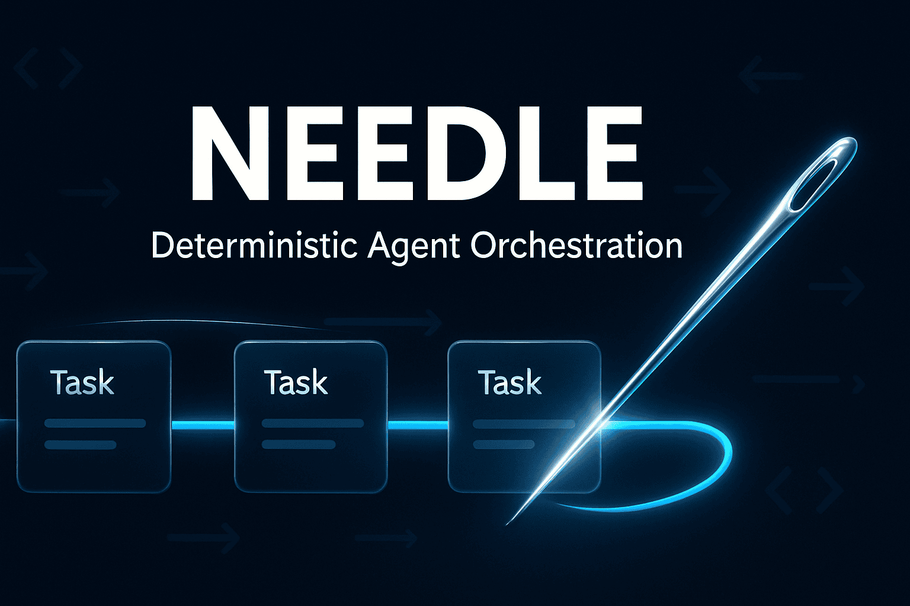

# 🧵 NEEDLE

[](LICENSE)
[](rust-toolchain.toml)
[](docs/post-push-ci.md)
[](https://github.com/jedarden/NEEDLE/releases/latest)

**N**avigates **E**very **E**nqueued **D**eliverable, **L**ogs **E**ffort

> Deterministic bead processing with explicit outcome paths.

NEEDLE is a wrapper for headless coding CLI agents. It processes a shared bead queue in deterministic order, dispatching work through its supported built-in adapters (Claude Code, OpenCode, Codex, and Aider) and handling every outcome through an explicit, predefined path.

---

## 🚀 Quickstart

Prerequisites: `git`, `tmux`, and an agent CLI on your `PATH` — the flow below uses
[Claude Code](https://claude.ai/code) (`claude`). Prebuilt binaries are Linux x86_64;
everything else builds from source (see below).

```bash
# 1. Install needle, its transform helpers, and the bead-rs backend
curl -fsSL https://github.com/jedarden/NEEDLE/releases/latest/download/install.sh | bash

# 2. Initialize your repo with the bead-rs backend
cd <your-repo> && needle init --backend bead-rs

# 3. Make sure your branch has an upstream — the shipped-work gate (on by
#    default) verifies that each closed bead's commit was pushed
git push -u origin "$(git branch --show-current)"

# 4. Create the bead store
bead init --prefix <name>

# 5. Create your first bead with one deliverable and one acceptance command
bead create \
  --title 'Add a CONTRIBUTING.md so that test -s CONTRIBUTING.md passes. Work on this issue directly.' \
  --description 'Create CONTRIBUTING.md with contribution guidelines. Acceptance: `test -s CONTRIBUTING.md`. Do not create sub-issues, split this work, or decompose it.' \
  --priority 2

# 6. Verify system health
needle doctor

# 7. Run a worker
needle run --agent claude --identifier alpha

# 8. List, check status, and attach to the session
needle list
needle status
needle attach alpha

# 9. Verify completion
bead list --status closed
test -s CONTRIBUTING.md
git rev-list origin/"$(git branch --show-current)"..HEAD
```

The completed run shows the bead as `closed`, `test -s CONTRIBUTING.md` exits
with status 0, and the final `git rev-list` prints nothing because the
shipped commit is already pushed.

For the complete lifecycle—including `stop`, `resume`, safe orphan cleanup,
scoped versus global actions, and workers that outlive tmux—see [Worker
Lifecycle and Safe Cleanup](docs/operations/worker-lifecycle.md).

**Heads-up:** the built-in `claude` adapter invokes `claude -p … --dangerously-skip-permissions`.
Unattended operation means no permission prompts; read `needle config` before pointing a
worker at a repository you care about.

**Shipped-work gate (step 3):** `worker.enforce_shipped_work` is `true` by default. Before
NEEDLE accepts a closure it checks that the dispatch produced a commit — on a path outside
`notes/` and `.beads/` — that has been **pushed to the branch's upstream** (agents are
instructed to commit and push; a bead note explaining why no code was needed also passes).
A workspace whose branch has no upstream — a plain `git init`, or `git remote add` without
`git push -u` — cannot be checked at all, so the quickstart's `git push -u` in step 3 is not
optional. For a repository that is genuinely local-only, disable the gate instead:

```yaml
# ~/.config/needle/config.yaml
worker:
  enforce_shipped_work: false
```

**Built-in validation gate for unguarded workspaces:** A workspace whose own
`.needle.yaml` declares neither `gates:` nor legacy `verification:` enters the
no-explicit-gate path. An explicit `gates: []` or `verification: []` remains an
opt-out. NEEDLE first lets the language-default resolver supply a `default_*`
gate; only when it supplies none does the shipped **interim fallback gate**
select a verifier from the committed workspace, in this exact order:

1. `scripts/definition-of-done.sh` — run `scripts/definition-of-done.sh`.
2. `go.mod` — run `go build ./... && go vet ./... && go test -short ./...`.
3. `Cargo.toml` — run `cargo build --all-targets && cargo test`.
4. `package.json` with a non-empty `scripts.test` — run `npm test`.
5. `pyproject.toml` — run `pytest -q`.
6. `pytest.ini` — run `pytest -q`.

The selected command runs in a clean `git archive HEAD` extraction, so it
judges committed state rather than the shared checkout. If no verifier is
selected, NEEDLE checks the source workspace with
`git status --porcelain --untracked-files=all` (the archive has no `.git`),
ignoring `.beads/` and `.needle-predispatch-sha` bookkeeping noise. A clean
status passes on the agent's exit code alone and emits one counted `WARN`,
`gate.no_verifier`, with reason `not_detected`; uncommitted work fails the
fallback gate. Extraction, spawn, and timeout failures are gate execution
errors; a non-zero verifier result is an ordinary verification failure.

Fallback command stderr is capped by the host setting
`validation.stderr_cap_bytes` (default `4096` bytes), and each command is
bounded by `validation.outcome_timeout_seconds` (default `50` seconds). The
fallback is armed by default, so every unguarded workspace without an
override is covered without a per-workspace config change; the rollout count
is only an inventory snapshot, not a hard-coded allowlist. When fallback
resolution is reached, the dispatch log records whether it is armed or opted
out. A workspace can explicitly opt out in its own `.needle.yaml`:

```yaml
validation:
  fallback_gate: false
```

The host-level `validation.fallback_gate` sets the default and the workspace
value wins. This fallback is the **INTERIM** mechanism. The
`needle-d1b2ee0d` runner is its planned replacement. A workspace-local
`scripts/definition-of-done.sh` is the hand-off for repositories that already
declare their own Definition of Done; that runner is intended to replace this
fallback gate rather than add another permanent gate layer.

**Build from source** (Rust 1.85+; NEEDLE pins its toolchain in `rust-toolchain.toml`):

```bash
cargo install --git https://github.com/jedarden/NEEDLE
cargo install --git https://github.com/jedarden/bead-rs --bin bead
```

The installer drops binaries in `~/.local/bin` (override with `NEEDLE_INSTALL_PATH`). An existing `bead` at or above the release version is kept.

### 🔒 Security Note

The installer automatically verifies SHA-256 checksums to ensure the downloaded binary has not been corrupted or tampered with. This verification is **enabled by default** for your protection.

**Checksum verification safeguards against:**
- Corrupted downloads that could crash or behave unpredictably
- Tampered binaries that could execute arbitrary malicious code
- Supply chain attacks where a malicious actor modifies releases

**To see full security options and tradeoffs:**
```bash
curl -fsSL https://github.com/jedarden/NEEDLE/releases/latest/download/install.sh | bash -s -- --help
```

> **⚠️ Warning:** The installer supports an opt-out flag (`--skip-checksum`) for emergency recovery scenarios, but this is **strongly discouraged** except as a temporary workaround when checksums.txt is unavailable due to network/infrastructure issues. See the help output for full security details.

A worker starts, claims the next bead, dispatches to your chosen agent CLI, and loops. Multiple workers can run in parallel against the same workspace — coordination is handled by the shared bead queue (no central orchestrator).

See [`docs/examples/quickstart/`](docs/examples/quickstart/) for a minimal workspace configuration and [`docs/examples/otel-collector/`](docs/examples/otel-collector/) for OpenTelemetry integration.

---

## 🧶 What is a bead?

A **bead** is a work item — the unit of work NEEDLE processes. Think of it as a structured task ticket: a title, a body describing the deliverable and acceptance criteria, a status (`open`, `in_progress`, `done`), and optional metadata like priority and dependencies.

Beads live in a **bead store** — a pluggable backend managed by a bead CLI. The current primary backend is **bead-rs**, which uses a SQLite database (`beads.db`) plus a checkpoint directory (`.beads/checkpoint/` with `current.json`, `forensic.jsonl`, and `objects/`). The legacy **bead-forge** backend uses `issues.jsonl`.

```bash
# Create a bead (bead-rs backend)
bead create --title "Add pagination to search results" --priority 2 --issue-type task

# List open beads
bead list --status open

# NEEDLE does the rest: claims, dispatches, and closes beads automatically
```

NEEDLE workers read from this store, claim the next available bead atomically, dispatch it to your chosen agent CLI, and close it on success — then loop.

---

## 🤔 Why NEEDLE

Existing agent orchestration tools are built for one of two shapes:

- **Conversational frameworks** (LangGraph, AutoGen, CrewAI) assume a chat loop with a human-in-the-loop or another LLM. They are bad at headless, long-running, cost-bounded work.
- **Workflow engines** (Temporal, Argo Workflows, Inngest) assume each step is deterministic code. They are bad at non-deterministic agent steps whose outcomes have to be classified and routed.

NEEDLE is the missing middle: a **deterministic state machine that drives non-deterministic agents.** Every outcome an agent can produce has an explicit handler. The agent's work is fuzzy; the orchestration around it is not.

---

## 🧠 Core Principle

NEEDLE is a **state machine**, not a script. Every bead transitions through a finite set of states, and every transition has a defined handler. There are no implicit fallbacks, no swallowed errors, no undefined paths.

```
If an outcome can happen, it has a handler.
If it doesn't have a handler, it cannot happen.
```

---

## 🔄 The NEEDLE Algorithm

A single worker executes this loop indefinitely:

```
┌─────────────────────────────────────────────────────┐
│                                                     │
│   ┌───────────┐                                     │
│   │  🔍 SELECT │◄────────────────────────────────┐  │
│   └─────┬─────┘                                  │  │
│         │                                        │  │
│         ▼                                        │  │
│   ┌───────────┐   race lost    ┌──────────┐     │  │
│   │  🔒 CLAIM  │──────────────►│ 🔁 RETRY  │─────┘  │
│   └─────┬─────┘               └──────────┘        │
│         │ claimed                                   │
│         ▼                                           │
│   ┌───────────┐                                     │
│   │ 📋 BUILD   │                                     │
│   └─────┬─────┘                                     │
│         │                                           │
│         ▼                                           │
│   ┌───────────┐                                     │
│   │ 🚀 DISPATCH│                                     │
│   └─────┬─────┘                                     │
│         │                                           │
│         ▼                                           │
│   ┌───────────┐                                     │
│   │ ⏳ EXECUTE │                                     │
│   └─────┬─────┘                                     │
│         │                                           │
│         ▼                                           │
│   ┌───────────┐                                     │
│   │ 📊 OUTCOME │                                     │
│   └─────┬─────┘                                     │
│         │                                           │
│         ├── ✅ success ──► close bead ──────────────┘
│         ├── ❌ failure ──► log + release ────────────┘
│         ├── ⏰ timeout ──► release + defer ──────────┘
│         └── 💀 crash ────► release + alert ──────────┘
│                                                     │
└─────────────────────────────────────────────────────┘
```

---

## 📐 Algorithm Steps

### 🔍 Step 1: Select

Query the bead queue for the next claimable bead in **deterministic priority order**. Selection is not random — given the same queue state, every worker computes the same ordering. Ties are broken by creation time (oldest first).

### 🔒 Step 2: Claim

Attempt an **atomic claim** via the bead CLI (`bead claim` for bead-rs, `bf claim` for bead-forge). SQLite transaction isolation guarantees exactly one worker succeeds. If the claim fails (race lost), return to Step 1 with the losing candidate excluded.

### 📋 Step 3: Build

Construct the prompt from the bead's context: title, body, workspace path, relevant files, and any dependency context. The prompt is a deterministic function of the bead state — same bead, same prompt.

### 🚀 Step 4: Dispatch

Load the agent adapter configuration (YAML), render the invoke template with the built prompt, and execute via `bash -c`. The agent runs headless — it receives a prompt, does work, and exits.

### ⏳ Step 5: Execute

The agent runs. NEEDLE waits. The only inputs are the exit code and stdout/stderr. There is no interactive communication during execution.

### 📊 Step 6: Outcome

Evaluate the result and follow the **explicit path** for the observed outcome:

| Outcome | Exit Code | Handler |
|---------|-----------|---------|
| ✅ **Success** | `0` | Validate output → close bead → log effort → **loop** |
| ❌ **Failure** | `1` | Log failure reason → release bead → increment retry count → **loop** |
| ⏰ **Timeout** | `124` | Release bead → mark deferred → **loop** |
| 💀 **Crash** | `>128` | Release bead → create alert bead → **loop** |
| 🏁 **Race Lost** | `4` | (Handled at Step 2) → exclude candidate → **retry select** |
| 🫙 **Queue Empty** | — | Enter strand escalation → **explore / mend / knot** |

Every row is implemented. There are no unhandled cases.

---

## 🧶 Strand Escalation

When the primary workspace has no claimable beads, NEEDLE follows a **strand sequence** to find or create work. Each strand is evaluated in order — the first strand that yields a bead wins.

| # | Strand | Agent? | Purpose |
|---|--------|--------|---------|
| 1 | 🪡 **Pluck** | Yes | Process beads from the assigned workspace |
| 2 | 🔧 **Mend** | No | Cleanup: orphaned claims, stale locks, health checks |
| 3 | 🔭 **Explore** | No | Search other workspaces for claimable beads |
| 4 | 🕸️ **Weave** | Yes | Create beads from documentation gaps *(opt-in)* |
| 5 | 🪢 **Unravel** | Yes | Propose alternatives for HUMAN-blocked beads *(opt-in)* |
| 6 | 💓 **Pulse** | Yes | Codebase health scans, auto-generate beads *(opt-in)* |
| 7 | 🪞 **Reflect** | Yes | Consolidate learnings from recent beads *(opt-in)* |
| 8 | 🪡 **Splice** | No | Document worker failures, create alert beads |
| 9 | 🪢 **Knot** | No | All strands exhausted — alert human, wait |

---

## ⚡ Parallel Workers

Multiple NEEDLE workers run independently with **no central orchestrator**. Coordination happens through the shared bead queue:

- **Atomicity** — the bead CLI's claim command uses SQLite transactions; exactly one worker wins each claim
- **Determinism** — all workers compute the same priority order; races are resolved by the database, not by timing
- **Independence** — each worker is a self-contained loop in its own tmux session
- **Naming** — workers use NATO alphabet identifiers: `alpha`, `bravo`, `charlie`, ...

```
  needle-claude-sonnet-alpha ──┐
  needle-claude-sonnet-bravo ──┤
  needle-codex-gpt4-charlie ───┼──► Shared .beads/ (SQLite + checkpoint)
  needle-opencode-qwen-delta ──┤
  needle-aider-sonnet-echo ────┘
```

---

## 🏗️ Supported Agents

The built-in adapters below are the supported command contracts. Each CLI must
be installed on `PATH` and authenticated with its provider before a worker is
started. Run `needle test-agent <adapter>` after installing a CLI; the command
checks the executable, version probe, prompt transport, and any output
transform without sending a model request.

| Agent | Adapter and prerequisites | Prompt transport and invocation | Output/usage |
|-------|---------------------------|--------------------------------|--------------|
| Claude Code | Built-in `claude`, `claude-sonnet`, or `claude-opus`; install `claude` and the `needle-transform-claude` helper | stdin; `claude -p --model <configured model> --max-turns <limit> --output-format stream-json --dangerously-skip-permissions --verbose < {prompt_file}` | `needle-transform-claude`; Claude stream-json usage |
| OpenCode | Built-in `opencode`; install `opencode` and configure its provider, model, and credentials | stdin; `opencode run --format json --auto < {prompt_file}` | OpenCode JSONL usage; the configured OpenCode model is used |
| Codex CLI | Built-in `codex`; install `codex`, authenticate it, and keep the configured model available | argument; `codex exec --model {model} --sandbox workspace-write --json "$(cat {prompt_file})"` | `needle-transform-codex`; Codex JSONL usage |
| Aider | Built-in `aider`; install `aider` and authenticate the configured provider/model | argument; `aider --model {model} --yes-always --message "$(cat {prompt_file})"` | Aider `Tokens: … sent, … received.` summary usage |

The built-in defaults are `claude-sonnet-4-6` for Claude, `gpt-5.6-terra`
for Codex, and `claude-sonnet-4-6` for Aider. OpenCode uses its own configured
default unless a custom adapter adds `--model`. The unattended permission
flags are intentional: review the command and provider credentials before
pointing a worker at a repository you care about.

Two separately installed adapters are also supported, but are not built into
the binary:

| Extension | Install/configure | Invocation contract |
|-----------|------------------|----------------------|
| Claude Code interactive | [`plugins/claude-interactive/`](plugins/claude-interactive/) | PTY wrapper around Claude Code; see [the plugin instructions](#-claude-interactive-plugin) |
| ZCode Agent headless | [`plugins/zcode-headless/`](plugins/zcode-headless/) | File-based prompt through `needle-zcode-headless`; see the [plugin README](plugins/zcode-headless/README.md) |

The `generic` built-in is only a copy-me YAML template whose placeholder
`my-agent` is not a supported executable. Custom CLIs can be added with a YAML
adapter in `agent.adapters_dir`; they are outside this matrix until their
installation, invocation, and isolated smoke test are documented.

---

## 🔌 claude-interactive Plugin

The `claude-interactive` plugin ships as a separate release asset. It wraps the Claude Code CLI in a PTY so workers run under your **Claude subscription** instead of consuming programmatic API credits.

**How it works:** NEEDLE pipes subprocess stdio, which causes `claude` to detect a non-TTY and switch to API billing. `claude-interactive` creates an internal PTY so `claude` sees a real terminal, keeping it in interactive/subscription mode.

**Prerequisites:**
- Python 3.10 or later
- `pyte` Python library (installed automatically by the installer, or manually via `pip install pyte`)
- The `claude` CLI on PATH

**Install:**

```bash
# Download the latest claude-interactive release
gh release download --repo jedarden/NEEDLE --pattern 'claude-interactive*'
chmod +x claude-interactive-install.sh
./claude-interactive-install.sh
```

**Note:** The installer will attempt to install `pyte` automatically. If your Python environment is externally managed (PEP 668, e.g., Debian 12, Ubuntu 23.04+, Homebrew Python), the installer will guide you through alternative installation methods.

**Run:**

```bash
cd /path/to/workspace
needle run --agent claude-interactive --count 4   # or: -i alpha to name a single worker
```

Source lives in [`plugins/claude-interactive/`](plugins/claude-interactive/).

---

## 📁 Repository Structure

```
NEEDLE/
├── Cargo.toml             # Rust crate manifest
├── install.sh             # One-line installer for prebuilt binaries
├── plugins/
│   └── claude-interactive/ # PTY wrapper — subscription billing adapter for Claude Code
├── src/
│   ├── main.rs            # Worker entry point
│   ├── lib.rs             # Library root
│   ├── agent_event.rs     # Agent event telemetry utilities
│   ├── claude_md_placement.rs  # CLAUDE.md placement logic
│   ├── commit_hook.rs     # Bead-Id trailer injection for git commits
│   ├── routing.rs         # Model-based adapter routing
│   ├── bead_store/        # Abstract bead backend interface
│   ├── bin/               # Auxiliary binaries (transform helpers)
│   ├── canary/            # Release channel promotion, canary tests
│   ├── claim/             # Atomic bead claiming via SQLite transactions
│   ├── cli/               # Command-line interface parsing
│   ├── config/            # `.needle.yaml` parsing and defaults
│   ├── cost/              # Token + USD spend tracking per bead and worker
│   ├── decision/          # Decision point detection, ADR management
│   ├── dispatch/          # Agent invocation + YAML adapter loading
│   ├── drift/             # Session similarity, clustering, divergence detection
│   ├── health/            # Liveness, stale-claim cleanup, watchdog
│   ├── learning/          # Retrospective extraction, learnings management
│   ├── mitosis/           # Child-aware bead splitting
│   ├── outcome/           # Explicit handler per outcome type
│   ├── peer/              # Multi-worker coordination, peer discovery
│   ├── prompt/            # Deterministic prompt construction from bead
│   ├── rate_limit/        # Provider/model concurrency and RPM rate limiting
│   ├── registry/          # Worker state registry
│   ├── sanitize/          # Output redaction (gitleaks integration)
│   ├── skill/             # Skill library, retrieval, promotion
│   ├── span/              # W3C trace context utilities
│   ├── stats/             # Aggregation engine, A/B comparison
│   ├── strand/            # Pluck / Mend / Explore / Weave / Unravel / Pulse / Reflect / Splice / Knot
│   ├── supervisor/        # Fleet supervisor daemon (auto-scale)
│   ├── telemetry/         # OTLP exporter, gen_ai semantic conventions
│   ├── trace/             # Trace capture, storage, retention
│   ├── transcript/        # Session JSONL parsing, action-outcome extraction
│   ├── types/             # Shared types, error definitions
│   ├── upgrade/           # Self-update, hot-reload, rollback
│   ├── validation/        # Pre-dispatch and post-execution checks
│   └── worker/            # Worker session and identity management
├── tests/                 # Integration tests
├── ci/                    # Docker images used by CI (runs on Argo Workflows)
├── config/                # Vendored gitleaks rules
└── docs/                  # Plan, research, examples, post-mortems
```

---

## 🔍 Observability

NEEDLE emits structured telemetry for every state transition, claim attempt, dispatch, and outcome. A silent worker is a broken worker.

### Exported Signals

| Signal | Description |
|--------|-------------|
| **Traces** | Spans for `worker.session`, `bead.lifecycle`, `bead.claim`, `agent.dispatch`, `strand.evaluated`, `outcome.handled` |
| **Metrics** | `needle.beads.completed`, `needle.beads.duration`, `needle.agent.tokens.input`, `needle.cost.usd`, and more |
| **Logs** | All events not represented as spans, with severity mapping (`ERROR` for failures, `WARN` for stale peers) |

### OpenTelemetry (OTLP) Export

NEEDLE can export telemetry to any OpenTelemetry-compatible backend (Jaeger, Tempo, Grafana, Honeycomb, Datadog, etc.) via OTLP.

**Minimal configuration (`.needle.yaml`):**

```yaml
telemetry:
  otlp_sink:
    enabled: true
    endpoint: "http://localhost:4317"  # gRPC, or :4318 for HTTP
    protocol: "grpc"
```

**Semantic conventions:** NEEDLE follows OpenTelemetry's `gen_ai.*` semantic conventions for LLM telemetry, enabling out-of-the-box integration with GenAI dashboards (Grafana GenAI app, Langfuse, Honeycomb AI, etc.).

See [`docs/plan/plan.md`](docs/plan/plan.md) for the complete semantic mapping table.

---

## 📊 Production Status

NEEDLE currently powers my own headless multi-agent workflow — workers run continuously against shared bead queues, dispatching to Claude Code and other CLIs, with full OTLP telemetry wired through. APIs are stable enough that I rebuild on top of them daily.

This is alpha software in the sense that **I'm the primary user**, not in the sense that "it doesn't work." Resource governance is delegated to [claude-governor](https://github.com/jedarden/claude-governor); session monitoring is handled by [ccdash](https://github.com/jedarden/ccdash).

If you want to run NEEDLE in your own workflow, open an issue and I'll help.

---

## 📚 Documentation

- **[Agent Onboarding](docs/agent-onboarding.md)** — Complete walkthrough from install to first closed bead, with expected output and failure modes (see also `llms.txt` for the agent-readable quickstart)
- **[Documentation Index](docs/README.md)** — Complete index of all 148 documentation files (ADRs, architecture, operations, investigations, reference)
- **[Configuration Reference](docs/configuration.md)** — Adapter YAML schema, all config options
- **[Worker Lifecycle and Safe Cleanup](docs/operations/worker-lifecycle.md)** — run, list, attach, stop, resume, and cleanup, including live-process recovery
- **[Binary Freshness Verification](docs/binary-freshness-verification.md)** — Guide for verifying automatic worker rotation when new binaries are deployed
- **[Plan](docs/plan/plan.md)** — Complete project architecture and implementation plan
- **[Integration Tests](tests/)** — Comprehensive test suite demonstrating all core functionality

---

## 🔗 Related Projects

- **[claude-governor](https://github.com/jedarden/claude-governor)** — caps API spend and enforces weekly Anthropic quotas across NEEDLE worker fleets
- **[ccdash](https://github.com/jedarden/ccdash)** — TUI for monitoring Claude Code sessions, token usage, and worker activity
- **[CLASP](https://github.com/jedarden/CLASP)** — drop-in proxy letting Claude Code target OpenAI, Gemini, Anthropic, or any LLM backend
- **[agentists-quickstart](https://github.com/jedarden/agentists-quickstart)** — opinionated DevPod workspaces for running Claude Code + NEEDLE

---

## 📄 License

MIT

---

Part of [jedarden.com](https://jedarden.com) · Read the write-up: [jedarden.com/projects/needle/](https://jedarden.com/projects/needle/)

*This GitHub repo is a read-only mirror of git.ardenone.com/jedarden/NEEDLE — issues and PRs are welcome here either way.*
