# ExploreConfig Initialization and Loading Flow

## Overview

`ExploreConfig` controls the Explore strand's multi-workspace bead discovery behavior. This document traces the complete initialization flow from "no config file" to a fully initialized `ExploreConfig`, documenting all merge points and default injection locations.

## Flowchart

```mermaid
flowchart TD
    Start[Worker Starts] --> LoadGlobal[Layer 1+2: Load Global Config]
    
    subgraph Layer1_2 ["Layer 1+2: Defaults + Global Config"]
        LoadGlobal --> GlobalExists{"~/.config/needle/<br/>config.yaml exists?"}
        GlobalExists -->|No| UseDefaults[Use Config::default]
        GlobalExists -->|Yes| ParseGlobalYAML[Parse YAML file]
        ParseGlobalYAML --> GlobalHasExplore{"strands.explore<br/>section present?"}
        GlobalHasExplore -->|Yes| MergeGlobalDefaults[Merge with field-level<br/>defaults via serde]
        GlobalHasExplore -->|No| UseExploreDefaults[Use ExploreConfig::default]
        UseDefaults --> ExploreDefaultsInjected
        MergeGlobalDefaults --> ExploreDefaultsInjected
        UseExploreDefaults --> ExploreDefaultsInjected
    end
    
    ExploreDefaultsInjected[ExploreConfig with defaults] --> LoadWorkspace[Layer 3: Load Workspace Config]
    
    subgraph Layer3 ["Layer 3: Workspace Config"]
        LoadWorkspace --> WorkspaceExists{".needle.yaml<br/>exists in workspace?"}
        WorkspaceExists -->|No| NoWorkspaceOverride[No workspace overrides]
        WorkspaceExists -->|Yes| ParseWorkspaceYAML[Parse .needle.yaml]
        ParseWorkspaceYAML --> WorkspaceHasExplore{"strands.explore<br/>in workspace file?"}
        WorkspaceHasExplore -->|No| WarnNonOverridable[Warn: non-overridable<br/>keys ignored]
        WorkspaceHasExplore -->|Yes| NoteExploreNotOverridable[Note: ExploreConfig<br/>is NOT workspace-overridable]
        NoteExploreNotOverridable --> WarnNonOverridable
        WarnNonOverridable --> NoWorkspaceOverride
    end
    
    NoWorkspaceOverride --> ApplyEnv[Layer 4: Environment Variables]
    
    subgraph Layer4 ["Layer 4: Environment Variables"]
        ApplyEnv --> ScanEnv[Scan NEEDLE_* env vars]
        ScanEnv --> CheckExploreEnv{"NEEDLE_STRANDS__EXPLORE_*<br/>env vars present?"}
        CheckExploreEnv -->|No| NoExploreEnvOverride[No Explore env overrides]
        CheckExploreEnv -->|Yes| ParseExploreEnv[Parse env vars]
        ParseExploreEnv --> ApplyExploreEnv["Apply overrides:<br/>NEEDLE_STRANDS__EXPLORE__ENABLED<br/>NEEDLE_STRANDS__EXPLORE__WORKSPACE_ROOT"]
    end
    
    NoExploreEnvOverride --> ApplyCLI[Layer 5: CLI Arguments]
    ApplyExploreEnv --> ApplyCLI[Layer 5: CLI Arguments]
    
    subgraph Layer5 ["Layer 5: CLI Arguments"]
        ApplyCLI --> CheckExploreCLI{"Explore-related<br/>CLI flags present?"}
        CheckExploreCLI -->|No| NoExploreCLIOverride[No Explore CLI overrides]
        CheckExploreCLI -->|Yes| NoteExploreNotOverridableCLI[Note: ExploreConfig<br/>has no CLI flags]
        NoteExploreNotOverridableCLI --> NoExploreCLIOverride
    end
    
    NoExploreCLIOverride --> ExpandTildes[Expand Tildes]
    
    subgraph PostProcessing ["Post-Processing"]
        ExpandTildes --> ExpandExplorePaths["Expand ~ in:<br/>workspace_root<br/>workspaces[]"]
        ExpandExplorePaths --> ValidateConfig[Validate final config]
        ValidateConfig --> FinalConfig[Fully Initialized<br/>ExploreConfig]
    end
    
    FinalConfig --> CreateExploreStrand[Create ExploreStrand]
    
    subgraph ExploreStrandInit ["ExploreStrand Initialization"]
        CreateExploreStrand --> CheckAutoDiscovery{"config.workspaces<br/>is empty?"}
        CheckAutoDiscovery -->|Yes| AutoDiscoveryMode[Set auto_discovery_mode=true]
        CheckAutoDiscovery -->|No| PinnedMode[Set auto_discovery_mode=false<br/>Emit WARN log]
        AutoDiscoveryMode --> RunDiscovery[Call discover_workspaces<br/>under workspace_root]
        PinnedMode --> UseExplicitList[Use explicit workspaces list]
        RunDiscovery --> DiscoveredWorkspaces[Discovered workspace list]
        UseExplicitList --> ExplicitWorkspaces[Explicit workspace list]
        DiscoveredWorkspaces --> InitializeStrand[Initialize ExploreStrand]
        ExplicitWorkspaces --> InitializeStrand[Initialize ExploreStrand]
    end
    
    InitializeStrand --> End[Explore Strand Ready]
```



## Configuration Layers in Order

### Layer 1: Compile-Time Type Defaults

**Source:** Rust `Default` trait implementation and serde field defaults

**Location:** `src/config/mod.rs:4616-4654`

```rust
impl Default for ExploreConfig {
    fn default() -> Self {
        ExploreConfig {
            enabled: Self::default_enabled(),           // true
            workspaces: Vec::new(),                      // empty
            workspace_root: Self::default_workspace_root(), // $HOME
            rediscovery_cycles: Self::default_rediscovery_cycles(), // 60
            starvation_threshold_minutes: Self::default_starvation_threshold_minutes(), // 15
            scan_interval_cycles: Self::default_scan_interval_cycles(), // 1
            max_scan_interval_cycles: Self::default_max_scan_interval_cycles(), // 8
        }
    }
}
```

**Default Values:**
- `enabled`: `true` — Explore strand is enabled by default
- `workspaces`: `[]` (empty) — enables recursive auto-discovery mode
- `workspace_root`: `$HOME` — scans user's home directory for workspaces
- `rediscovery_cycles`: `60` — refresh workspace list every 60 cycles (~1 hour)
- `starvation_threshold_minutes`: `15` — warn if no claims for 15 minutes
- `scan_interval_cycles`: `1` — base scan interval
- `max_scan_interval_cycles`: `8` — maximum adaptive backoff interval

### Layer 2: Global Config File

**Source:** `~/.config/needle/config.yaml` (YAML format)

**Location:** `src/config/mod.rs:7596-7619`

**Loading Logic:**
```rust
pub fn load_global() -> Result<Config> {
    let path = dirs_or_home(".config/needle/config.yaml");
    Self::load_from_path(&path)
}

pub fn load_from_path(path: &Path) -> Result<Config> {
    if !path.exists() {
        let mut config = Config::default();  // ← Layer 1 defaults
        config.expand_tildes();
        return Ok(config);
    }
    let text = std::fs::read_to_string(path)?;
    let mut config: Config = serde_yaml::from_str(&text)?;  // ← Merge with defaults
    config.expand_tildes();
    Ok(config)
}
```

**How Merging Works:**
- serde's `#[serde(default)]` on `StrandsConfig.explore` field ensures missing sections use `ExploreConfig::default()`
- serde's `#[serde(default = "ExploreConfig::default_enabled")]` on individual fields ensures missing fields use field-level defaults
- Present fields override defaults; absent fields retain defaults

**Example YAML:**
```yaml
strands:
  explore:
    enabled: false              # Override default (true → false)
    workspace_root: ~/code      # Override default ($HOME → ~/code)
    # workspaces: []            # Absent → use default (empty)
    # rediscovery_cycles: 60   # Absent → use default (60)
```

**After Layer 2:**
- `enabled`: `false` (from YAML)
- `workspaces`: `[]` (from defaults)
- `workspace_root`: `~/code` (from YAML)
- `rediscovery_cycles`: `60` (from defaults)
- `starvation_threshold_minutes`: `15` (from defaults)
- `scan_interval_cycles`: `1` (from defaults)
- `max_scan_interval_cycles`: `8` (from defaults)

### Layer 3: Workspace Config File

**Source:** `.needle.yaml` in workspace root (YAML format)

**Location:** `src/config/mod.rs:7621-7639`

**Important:** `ExploreConfig` is **NOT** a workspace-overridable configuration.

From `src/config/mod.rs:7696-7777`, the `apply_workspace()` function only applies specific overridable fields:

```rust
pub fn apply_workspace(config: &mut Config, overrides: &WorkspaceOverrides, ...) {
    let source = ConfigSource::WorkspaceFile(ws_path.join(".needle.yaml"));
    
    // ... agent overrides ...
    // ... strands.weave overrides ...
    // ... strands.pulse overrides ...
    // ... strands.unravel overrides ...
    // NOTE: No strands.explore overrides here!
}
```

**If `.needle.yaml` contains `strands.explore`:**
- The key is detected as **non-overridable**
- A WARN log is emitted at startup
- The configuration is **silently ignored**

**Example `.needle.yaml` (WARNINGS emitted):**
```yaml
strands:
  explore:
    enabled: false              # ⚠️ IGNORED - not workspace-overridable
    workspace_root: ~/custom    # ⚠️ IGNORED - not workspace-overridable
```

**After Layer 3:** No changes to ExploreConfig from Layer 2 state.

### Layer 4: Environment Variables

**Source:** `NEEDLE_*` environment variables

**Location:** `src/config/mod.rs:7782-8038`

**Supported ExploreConfig env vars:**
- `NEEDLE_STRANDS__EXPLORE__ENABLED` → `strands.explore.enabled`
- `NEEDLE_STRANDS__EXPLORE__WORKSPACE_ROOT` → `strands.explore.workspace_root`

**Parsing Logic:**
```rust
pub fn apply_env_overrides(config: &mut Config, sources: &mut SourceMap) {
    for (key, value) in std::env::vars() {
        if let Some(suffix) = key.strip_prefix("NEEDLE_") {
            let config_path = suffix.to_lowercase().replace("__", ".");
            
            match config_path.as_str() {
                "strands.explore.enabled" => {
                    if let Ok(v) = value.parse::<bool>() {
                        config.strands.explore.enabled = v;
                        sources.insert(config_path, ConfigSource::EnvVar(key));
                    }
                }
                "strands.explore.workspace_root" => {
                    config.strands.explore.workspace_root = PathBuf::from(&value);
                    sources.insert(config_path, ConfigSource::EnvVar(key));
                }
                // ... other env vars ...
            }
        }
    }
}
```

**Example:**
```bash
export NEEDLE_STRANDS__EXPLORE__ENABLED=false
export NEEDLE_STRANDS__EXPLORE__WORKSPACE_ROOT=/opt/code
```

**After Layer 4 (assuming Layer 2 had `enabled: false`, `workspace_root: ~/code`):**
- `enabled`: `false` → overridden by env var → `false`
- `workspaces`: `[]` (unchanged)
- `workspace_root`: `~/code` → overridden by env var → `/opt/code`
- `rediscovery_cycles`: `60` (unchanged)
- `starvation_threshold_minutes`: `15` (unchanged)
- `scan_interval_cycles`: `1` (unchanged)
- `max_scan_interval_cycles`: `8` (unchanged)

### Layer 5: CLI Arguments

**Source:** Command-line arguments

**Location:** `src/config/mod.rs:8048-8068`

**Important:** `ExploreConfig` has **no CLI argument flags**.

The `apply_cli_overrides()` function does not include any ExploreConfig-related CLI flags.

**After Layer 5:** No changes to ExploreConfig from Layer 4 state.

### Post-Processing: Tilde Expansion

**Location:** `src/config/mod.rs:6636-6698`

After all layers are merged, `expand_tildes()` is called:

```rust
pub fn expand_tildes(&mut self) {
    // ...
    self.strands.explore.workspace_root = expand_tilde(&self.strands.explore.workspace_root);
    self.strands.explore.workspaces = expand_tilde_vec(&self.strands.explore.workspaces);
    // ...
}
```

**Function:**
```rust
fn expand_tilde(path: &Path) -> PathBuf {
    let path_str = path.as_os_str().to_str().unwrap_or("");
    if path_str.starts_with("~/") {
        if let Some(home) = std::env::var("HOME").ok() {
            return PathBuf::from(home).join(&path_str[2..]);
        }
    }
    PathBuf::from(path_str)
}
```

**Examples:**
- `~/code` → `/home/user/code`
- `~` → `/home/user`
- `/absolute/path` → `/absolute/path` (unchanged)
- `relative/path` → `relative/path` (unchanged)

## ExploreStrand Initialization

**Location:** `src/strand/explore.rs:198-267`

After config is fully loaded, `ExploreStrand::new()` is called:

```rust
pub fn new(
    config: ExploreConfig,
    home_workspace: PathBuf,
    registry: Registry,
    telemetry: Telemetry,
    qualified_id: String,
) -> Self {
    // Determine if we're in auto-discovery mode
    let auto_discovery_mode = config.workspaces.is_empty();
    
    // If workspaces is empty, auto-discover under workspace_root
    let workspaces = if auto_discovery_mode {
        Self::discover_workspaces(&config.workspace_root)
    } else {
        config.workspaces
    };
    
    // Emit WARN if running in pinned mode
    if !workspaces.is_empty() && !auto_discovery_mode {
        tracing::warn!(
            mode = "pinned",
            workspaces_count = workspaces.len(),
            "Explore running in PINNED mode"
        );
    }
    
    // ... initialize strand fields ...
}
```

### Auto-Discovery vs. Pinned Mode

**Auto-Discovery Mode (default, recommended):**
- `config.workspaces` is empty (`[]`)
- Recursively scans `config.workspace_root` (default: `$HOME`)
- Finds all directories containing `.beads/` subdirectory
- **Automatically picks up new workspaces** without config changes

**Pinned Mode (exception mechanism):**
- `config.workspaces` is non-empty
- Only scans explicitly listed workspace paths
- WARN log emitted at startup
- Used for restricting specific workers to fixed repo sets

## Configuration Precedence (Highest to Lowest)

1. **Environment Variables** (`NEEDLE_STRANDS__EXPLORE_*`)
2. **Global Config File** (`~/.config/needle/config.yaml`)
3. **Compile-Time Defaults** (`ExploreConfig::default()`)

**Note:** Workspace config (`.needle.yaml`) and CLI arguments cannot override ExploreConfig.

## Complete Example: No Config File

**Scenario:** Fresh installation, no config files exist

**Flow:**

1. **Worker starts** → `ConfigLoader::load_resolved()`
2. **Layer 1+2:** `~/.config/needle/config.yaml` doesn't exist → use `Config::default()`
3. **Layer 3:** `.needle.yaml` doesn't exist → no workspace overrides
4. **Layer 4:** No `NEEDLE_STRANDS__EXPLORE_*` env vars → no env overrides
5. **Layer 5:** No Explore-related CLI flags → no CLI overrides
6. **Post-processing:** Expand tildes (none to expand)
7. **Result:** Fully-default `ExploreConfig`

**Final ExploreConfig state:**
```rust
ExploreConfig {
    enabled: true,
    workspaces: [],
    workspace_root: /home/user,  // expanded from $HOME
    rediscovery_cycles: 60,
    starvation_threshold_minutes: 15,
    scan_interval_cycles: 1,
    max_scan_interval_cycles: 8,
}
```

**ExploreStrand behavior:**
- Auto-discovery mode enabled (`workspaces.is_empty()`)
- Scans `/home/user` for directories containing `.beads/`
- Refreshes workspace list every 60 cycles
- Warns if no beads claimed for 15 minutes

## Complete Example: Global Config + Env Var

**Scenario:** Admin sets global config, operator overrides with env var

**`~/.config/needle/config.yaml`:**
```yaml
strands:
  explore:
    enabled: false
    workspace_root: ~/projects
```

**Environment:**
```bash
export NEEDLE_STRANDS__EXPLORE__ENABLED=true
```

**Flow:**

1. **Layer 1+2:** Load global config
   - `enabled`: `false` (from YAML)
   - `workspace_root`: `~/projects` (from YAML)
   - Other fields: defaults

2. **Layer 3:** Workspace config ignored (ExploreConfig not overridable)

3. **Layer 4:** Apply env vars
   - `enabled`: `false` → `true` (overridden by `NEEDLE_STRANDS__EXPLORE__ENABLED`)
   - `workspace_root`: `~/projects` (unchanged, no env var)

4. **Layer 5:** No CLI overrides

5. **Post-processing:** Expand `~/projects` → `/home/user/projects`

**Final ExploreConfig state:**
```rust
ExploreConfig {
    enabled: true,                    // ← env var override
    workspaces: [],
    workspace_root: /home/user/projects,  // ← expanded from YAML
    rediscovery_cycles: 60,
    starvation_threshold_minutes: 15,
    scan_interval_cycles: 1,
    max_scan_interval_cycles: 8,
}
```

## Key Takeaways

1. **Defaults First:** All configuration starts with compile-time defaults from `ExploreConfig::default()`

2. **Layered Merging:** Each layer (global config, env vars) overrides previous layers, but only for fields explicitly set

3. **Workspace Config Blocked:** ExploreConfig cannot be overridden by `.needle.yaml` — attempting to do so emits WARN logs and is silently ignored

4. **Environment Variables Win:** `NEEDLE_STRANDS__EXPLORE_*` env vars override everything except compile-time defaults

5. **Tilde Expansion Last:** All `~` paths are expanded after all layers are merged

6. **Auto-Discovery Default:** The recommended (and default) configuration is `workspaces: []`, which enables automatic workspace discovery under `workspace_root`

7. **Pinned Mode Warns:** Setting `workspaces` to a non-empty list triggers a WARN log at startup, making it clear the worker is running in restricted mode

## Related Documentation

- [Explore Strand Architecture](../strand/explore/README.md)
- [Configuration System Overview](config-system.md)
- [Workspace Discovery](workspace-discovery.md)
- [ADR-015: Concurrent Same-Repo Worker Isolation](../adr/015-concurrent-same-repo-worker-isolation.md)
